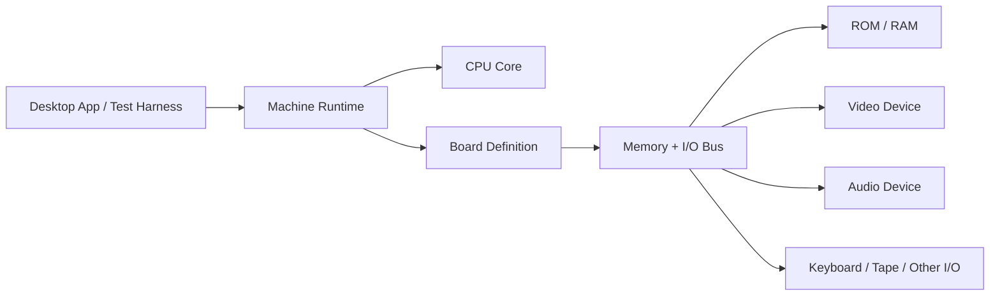

# Emulator Architecture

## Purpose

This repository will host a reusable emulator platform for 8-bit machines.

The first machine is:

- `ZX Spectrum 48K`

The next planned machine is:

- `Radio-86RK`

The design goal is to keep CPU, bus, memory, timing, and peripherals replaceable without rebuilding the whole emulator around each new machine.

## Chosen Stack

- Language: `Java 21 LTS`
- Build: `Gradle`
- Tests: `JUnit 5`
- Desktop shell later: `JavaFX`
- Logging: `SLF4J` + `Logback`

This choice is intentionally pragmatic: the architecture carries the timing discipline, while Java gives us fast iteration, strong tooling, and enough performance headroom for this class of emulator.

## Goals

- Build a cycle-aware emulator platform rather than a one-off Spectrum codebase.
- Keep CPU cores independent from concrete memory and I/O devices.
- Support machine-specific timing, contention, interrupts, and wait states.
- Make board composition explicit and testable.
- Allow a future `Radio-86RK` machine to reuse the same runtime model.

## Non-Goals For The First Milestone

- `ZX Spectrum 128K`
- `AY-3-8912`
- disk subsystems
- transistor-level simulation
- JIT or native code generation
- browser deployment

## Architectural Principles

### 1. Machine Over Application

The emulator core models a machine. The desktop app is just one frontend.

The core must be runnable:

- headless in tests
- under a debugger
- inside a desktop app
- inside future tooling such as a disassembler or trace runner

### 2. CPU Does Not Own The Hardware

The CPU knows how to execute instructions and request machine cycles.

The machine decides:

- what memory exists
- which ports respond
- which accesses are contended
- when interrupts arrive
- how many extra wait states are inserted

### 3. Time Is A First-Class Concern

We model execution on a master `t-state` timeline.

That timeline is the coordination point for:

- CPU execution
- ULA timing
- interrupts
- audio edges
- tape input/output
- future DMA-like or bus-arbitrating devices

### 4. Devices Are Replaceable

ROM, RAM, keyboard, beeper, tape, video, and future chips are modules behind stable interfaces.

The machine board wires them together.

### 5. Hot Path Must Stay Simple

The execution hot path must avoid:

- per-access allocations
- boxed primitives
- reflection
- stream pipelines
- string logging

This matters more than micro-optimizing individual instructions.

## Logical Architecture



## Gradle Module Layout

Initial physical modules:

- `:emu-platform`
  Shared contracts, time model, machine runtime, routing helpers, snapshots, common test support.
- `:cpu-z80`
  Z80 core only.
- `:machine-spectrum`
  Spectrum board, memory map, ULA model, keyboard, tape, beeper, ROM loading.
- `:app-desktop`
  Window, input mapping, frame presentation, audio output, file dialogs, snapshots.

Planned later:

- `:cpu-i8080`
  For Intel 8080 and Soviet-compatible variants such as `KR580VM80A`.
- `:machine-radio86rk`
  Radio-86RK board assembled on the same platform.

Important note: replaceable modules are primarily a runtime architecture concern. We do not need one Gradle project per chip or device on day one.

## Core Contracts

The exact Java APIs may evolve, but these boundaries are fixed.

### CPU Contract

The CPU module is responsible for:

- registers and flags
- instruction decode
- interrupt modes and acceptance
- refresh behavior
- alternate register sets where applicable
- instruction timing tables

The CPU module is not responsible for:

- RAM arrays
- port maps
- contention rules
- frame timing
- UI input

Conceptual interface:

```java
public interface Cpu {
    void reset();
    void requestMaskableInterrupt();
    void requestNonMaskableInterrupt();
    int runInstruction();
}
```

`runInstruction()` executes one instruction against the current bus and returns total consumed `t-states`, including machine-added delays.

### Bus Contract

The bus is the only path between the CPU and hardware-visible machine state.

Conceptual responsibilities:

- opcode fetch
- memory read/write
- I/O read/write
- interrupt acknowledge
- refresh observation
- wait-state injection

Conceptual shape:

```java
public interface CpuBus {
    int fetchOpcode(int address);
    int readMemory(int address);
    void writeMemory(int address, int value);
    int readPort(int port);
    void writePort(int port, int value);
    void onRefresh(int irValue);
    int currentTState();
}
```

The concrete implementation may expose more detailed access classifications such as opcode fetch vs data read, but the CPU must still go through the bus for every externally visible cycle.

### Machine Runtime

The runtime owns:

- the master time counter
- the active board
- the active CPU
- stepping policy
- reset lifecycle
- snapshot coordination

The runtime is what the app or tests talk to.

### Devices

Devices are wired into a board and may participate through:

- address decoding
- port decoding
- time observation
- interrupt generation
- audio or video output

Examples:

- `RomDevice`
- `RamDevice`
- `KeyboardMatrixDevice`
- `BeeperDevice`
- `TapeDevice`
- `SpectrumUlaDevice`

## Execution Model

We use a single master clock measured in `t-states`.

### Base Flow

1. Runtime asks CPU to execute one instruction.
2. CPU issues fetch, memory, and port requests through the bus.
3. Bus routes the request to the mapped device.
4. Board timing policy may inject additional wait states.
5. Runtime advances global time.
6. Devices consume elapsed time and update internal state.

### Why This Matters

For `ZX Spectrum 48K`, contention must be modeled at the machine level. The CPU instruction table knows nominal timings, but the board decides whether memory or I/O access is delayed by the ULA.

That keeps the Z80 core reusable for machines that do not share Spectrum timing rules.

## ZX Spectrum 48K Board

### Required MVP Characteristics

- `Z80A`-compatible CPU behavior
- `16 KB ROM`
- `48 KB RAM`
- `ULA`-driven display behavior
- keyboard matrix
- port `0xFE`
- beeper
- tape input/output
- 50 Hz frame-based interrupt behavior

### Board-Level Responsibilities

The Spectrum board owns:

- memory map
- port decoding
- contention rules
- screen memory interpretation
- border color state
- floating-bus behavior later in the roadmap

### Spectrum-Specific Timing Notes

The architecture must allow the board to model known Spectrum details such as:

- contended memory in `0x4000` to `0x7FFF`
- ULA-driven delays on reads and writes
- ULA interaction with port `0xFE`
- line timing based on fixed `t-state` counts
- refresh-visible behavior important for edge cases

Those machine rules belong in `:machine-spectrum`, not in `:cpu-z80`.

## Radio-86RK Compatibility Impact

The future `Radio-86RK` target changes several fundamental pieces:

- CPU family changes from `Z80` to `8080`-compatible `KR580VM80A`
- video subsystem changes significantly
- bus arbitration and slowdown rules differ
- I/O devices and ROM software differ

Because of that, the reusable parts must be:

- runtime
- time model
- bus routing model
- memory and device abstractions
- desktop shell
- snapshot and trace infrastructure where possible

The machine-specific parts must remain separate:

- CPU module
- board wiring
- timing policy
- ROM layout
- device implementations tied to the machine

## Testing Strategy

Testing is part of the architecture, not an afterthought.

### CPU Tests

- instruction correctness tests
- flag behavior tests
- prefix handling tests
- interrupt mode tests
- timing table tests
- external validation with standard Z80 test ROMs

### Machine Tests

- memory map tests
- port `0xFE` behavior tests
- keyboard matrix tests
- contention timing tests
- ROM boot tests up to BASIC prompt

### Regression Tests

- deterministic trace tests
- snapshot load/store tests
- framebuffer checksum or screenshot tests
- audio edge tests for beeper/tape transitions

## Implementation Phases

### Phase 0: Documentation

- accept Java-based architecture
- document module boundaries
- document MVP scope

### Phase 1: Platform Skeleton

- create Gradle multi-project layout
- add `:emu-platform`
- add base runtime, bus contracts, and common test helpers

### Phase 2: Z80 Core

- registers, flags, and instruction decode
- `CB`, `ED`, `DD`, `FD` prefixes
- interrupt handling
- refresh behavior
- timing tables

### Phase 3: CPU Validation

- unit tests
- timing tests
- test ROM integration

### Phase 4: Spectrum Board MVP

- ROM and RAM
- memory map
- keyboard matrix
- port `0xFE`
- border and basic beeper
- boot to ROM and BASIC prompt

### Phase 5: Spectrum Timing Accuracy

- ULA contention
- interrupt cadence
- screen timing
- floating bus
- tape edge timing

### Phase 6: Desktop Shell

- window and scaling
- keyboard mapping
- audio output
- ROM and snapshot loading

### Phase 7: Second Machine

- add `:cpu-i8080`
- add `:machine-radio86rk`
- reuse shared runtime and app shell

## Coding Rules For The Core

- Prefer primitive fields and arrays in hot code.
- Keep instruction decode table-driven where it improves clarity.
- Separate correctness from optimization.
- Do not let UI classes leak into core modules.
- Do not encode Spectrum assumptions in shared platform classes.
- Treat machine timing as data plus board policy, not as scattered special cases.

## References

- Local CPU spec: `z80cpu_um.pdf`
- ZX Spectrum reference: `https://worldofspectrum.org/faq/reference/48kreference.htm`
- ZX Spectrum hardware summary: `https://worldofspectrum.org/faq/reference/hardware.htm`
- Radio-86RK background: `https://ru.wikipedia.org/wiki/Радио-86РК`
